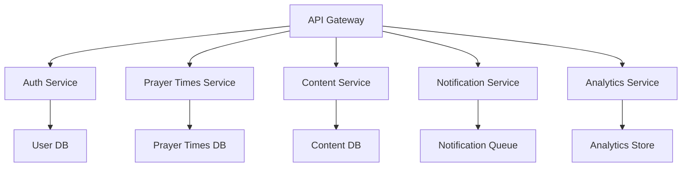

# Modern Digital Masjid Platform - Backend Architecture

## System Architecture

### Microservices Architecture


## Core Services

### 1. API Gateway
- GraphQL-based API gateway for flexible data querying
- REST endpoints for specific operations
- WebSocket support for real-time updates
- Built with Apollo Gateway or similar modern GraphQL gateway

### 2. Authentication Service
```typescript
interface AuthConfig {
  providers: {
    oauth: {
      google?: OAuthConfig;
      microsoft?: OAuthConfig;
    };
    jwt: JWTConfig;
    apiKey: APIKeyConfig;
  };
  rbac: {
    roles: Role[];
    permissions: Permission[];
  };
}

interface UserProfile {
  id: string;
  organizationId: string;
  roles: Role[];
  metadata: Record<string, any>;
}
```

### 3. Prayer Times Service
```typescript
interface PrayerTimeConfig {
  calculationMethods: {
    method: CalculationMethod;
    params: CalculationParams;
  }[];
  adjustments: {
    seasonal: SeasonalAdjustment[];
    manual: ManualAdjustment[];
  };
  notifications: NotificationConfig;
}

interface PrayerTimeData {
  id: string;
  organizationId: string;
  date: string;
  times: {
    [key in PrayerName]: {
      calculatedTime: string;
      adjustedTime: string;
      jamaahTime: string;
    };
  };
  metadata: Record<string, any>;
}
```

### 4. Content Service (Headless CMS)
- Integration with modern headless CMS platforms:
  - Strapi
  - Contentful
  - Sanity
  - Custom implementation

```typescript
interface ContentModel {
  type: 'hadith' | 'announcement' | 'event' | 'page';
  schema: JSONSchema;
  validations: ValidationRule[];
  workflows: WorkflowConfig[];
}

interface ContentEntry {
  id: string;
  organizationId: string;
  type: string;
  status: 'draft' | 'published' | 'archived';
  data: Record<string, any>;
  locales: string[];
  schedule: {
    publishAt?: string;
    unpublishAt?: string;
  };
}
```

### 5. Notification Service
```typescript
interface NotificationConfig {
  channels: {
    push?: PushConfig;
    email?: EmailConfig;
    sms?: SMSConfig;
    display?: DisplayConfig;
  };
  templates: NotificationTemplate[];
  rules: NotificationRule[];
}
```

## Data Storage

### 1. Primary Database
- PostgreSQL for structured data
- TimescaleDB extension for time-series data (prayer times)
- PostGIS extension for location-based features

### 2. Caching Layer
- Redis for:
  - Session management
  - Real-time data
  - Distributed caching
  - Rate limiting

### 3. Search Engine
- Elasticsearch for:
  - Full-text search
  - Analytics
  - Content indexing

### 4. Message Queue
- Apache Kafka for:
  - Event streaming
  - Real-time updates
  - Service communication

## API Design

### 1. GraphQL Schema
```graphql
type Organization {
  id: ID!
  name: String!
  settings: OrganizationSettings!
  prayerTimes: PrayerTimeConnection!
  content: ContentConnection!
  members: UserConnection!
}

type PrayerTime {
  id: ID!
  date: Date!
  times: PrayerTimes!
  jamaahTimes: JamaahTimes
  adjustments: [TimeAdjustment!]
  metadata: JSON
}

type Content {
  id: ID!
  type: String!
  data: JSON!
  status: PublishStatus!
  schedule: Schedule
  locales: [String!]!
}

type Subscription {
  prayerTimeUpdated: PrayerTime!
  contentPublished: Content!
  announcementCreated: Announcement!
}
```

### 2. REST Endpoints
- Reserved for specific operations:
  - File uploads
  - Webhooks
  - Legacy system integration
  - Health checks

## Modern Features

### 1. Multi-tenant Architecture
```typescript
interface TenantConfig {
  id: string;
  domain: string;
  features: Feature[];
  limits: ResourceLimits;
  branding: BrandingConfig;
}
```

### 2. Extensibility
- Plugin system for custom features
- Webhook system for integrations
- Custom field support
- Workflow automation

### 3. Analytics & Insights
- Prayer attendance tracking
- Content engagement metrics
- Community insights
- Performance analytics

### 4. AI/ML Integration
- Smart content recommendations
- Automated content moderation
- Prayer time optimization
- Attendance prediction

## Infrastructure

### 1. Container Orchestration
- Kubernetes-native deployment
- Service mesh (Istio)
- Automated scaling
- Zero-downtime updates

### 2. Observability
```yaml
monitoring:
  metrics:
    - prometheus
    - grafana
  logging:
    - elasticsearch
    - kibana
  tracing:
    - jaeger
  alerting:
    - alertmanager
```

### 3. Security
- Zero-trust architecture
- OAuth2/OIDC authentication
- RBAC authorization
- Data encryption at rest and in transit
- Regular security audits

### 4. DevOps
- GitOps workflow
- CI/CD pipelines
- Infrastructure as Code
- Automated testing
- Chaos engineering

## API Versioning Strategy
```typescript
interface APIVersion {
  version: string;
  status: 'current' | 'deprecated' | 'sunset';
  deprecationDate?: string;
  sunsetDate?: string;
}
```

## Data Migration Strategy
```typescript
interface MigrationConfig {
  version: string;
  steps: MigrationStep[];
  rollback: RollbackStep[];
  validation: ValidationStep[];
}
```

## Integration Capabilities

### 1. Third-party Systems
- Prayer time calculation services
- Weather services
- Social media platforms
- Community management systems

### 2. Mobile Apps
- Native app support
- Push notifications
- Offline capabilities
- Location services

### 3. IoT Integration
- Smart displays
- Sensor integration
- Automated systems
- Environmental controls

## Development Experience

### 1. Developer Portal
- Interactive API documentation
- SDKs and client libraries
- Development tools
- Testing environment

### 2. Community Support
- Developer forum
- Knowledge base
- Code examples
- Integration guides

This modern architecture enables:
- Platform independence
- Scalability
- Extensibility
- Real-time capabilities
- Multi-channel content delivery
- Advanced analytics
- AI/ML integration
- Community features 